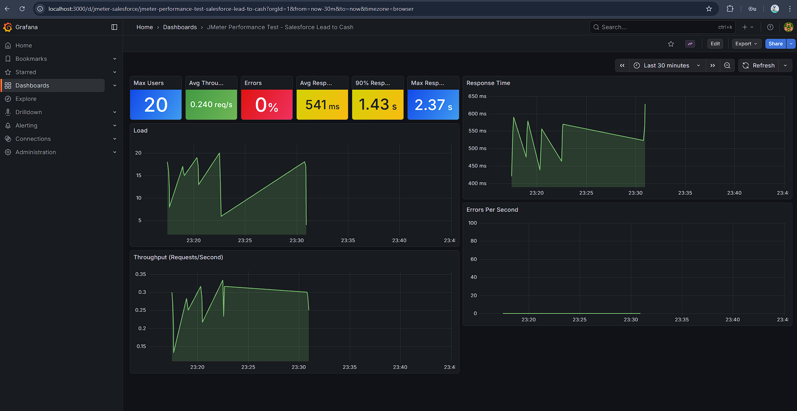
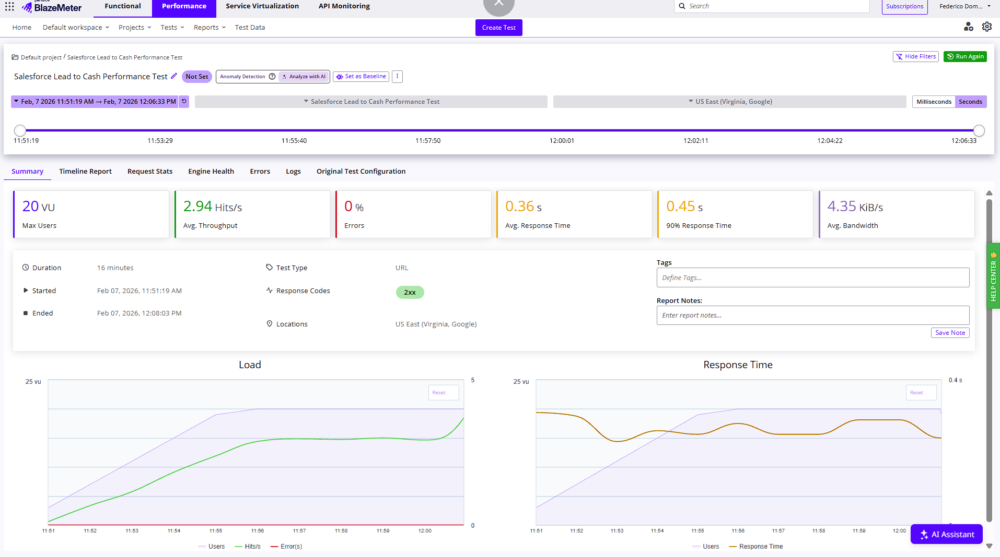

# Salesforce Performance Testing with JMeter Java DSL

A production-ready performance testing framework for Salesforce APIs using **JMeter Java DSL 2.1**. This project demonstrates a modern, code-first approach to performance engineering — replacing traditional JMX files with type-safe, maintainable Java code — with support for local execution, real-time Grafana monitoring, BlazeMeter cloud-scale testing, and AI-assisted debugging.


---

## 📋 Table of Contents

- [Overview](#-overview)
- [Architecture](#-architecture)
- [Features](#-features)
- [Project Structure](#-project-structure)
- [Prerequisites](#-prerequisites)
- [Setup](#-setup)
- [Running Tests](#-running-tests)
- [Test Scenario: Lead-to-Cash](#-test-scenario-lead-to-cash)
- [Debug Mode (AI-Assisted Analysis)](#-debug-mode-ai-assisted-analysis)
- [Real-Time Monitoring with Grafana](#-real-time-monitoring-with-grafana)
- [BlazeMeter Cloud Execution](#-blazemeter-cloud-execution)
- [CI/CD Pipeline](#-cicd-pipeline)
- [Configuration Reference](#-configuration-reference)
- [Salesforce Setup](#-salesforce-setup)
- [Troubleshooting](#-troubleshooting)
- [Best Practices](#-best-practices)
- [Tech Stack](#-tech-stack)

---

## 🎯 Overview

This project implements a comprehensive **Lead-to-Cash** performance testing suite for Salesforce using the JMeter Java DSL framework. It validates Salesforce API performance under realistic load conditions, following enterprise software engineering patterns.

### Why JMeter Java DSL?

| Traditional JMeter | JMeter Java DSL (This Project) |
|---|---|
| XML-based `.jmx` files | Type-safe Java code |
| GUI-dependent test creation | IDE-native development with IntelliSense |
| Hard to version control | Full Git integration with meaningful diffs |
| Manual CI/CD integration | First-class Maven/Gradle support |
| Copy-paste reuse | Object-oriented service layer pattern |

### Key Highlights

- **20 concurrent users** successfully tested on BlazeMeter cloud (5-minute ramp-up, 5-minute hold)
- **Zero-error execution** across the full Lead-to-Cash workflow
- **P99 response time < 5 seconds** assertion validated in cloud execution
- **Real-time dashboards** with InfluxDB + Grafana monitoring stack
- **Automated CI/CD** via GitHub Actions with artifact collection

---

## 🏗️ Architecture

```
┌─────────────────────────────────────────────────────────────────┐
│                        Test Runner                              │
│              (PerformanceTest.java — JUnit 5)                   │
│         @Tag("local") │ @Tag("cloud") │ @Tag("debug")          │
├──────────────────────┬─────────────────┬────────────────────────┤
│   Local Execution    │ Cloud Execution │   Debug Execution      │
│  LeadToCashTestPlan  │ LeadToCashBM    │  getDebugTestPlan()    │
│  + InfluxDB Listener │ + BlazeMeter    │  + TestResultLogger    │
│  + HTML Reporter     │   Engine        │  + HTML Reporter       │
├──────────────────────┴─────────────────┴────────────────────────┤
│                     Thread Groups                               │
│  ┌──────────┐   ┌──────────────┐   ┌──────────────────┐        │
│  │  Setup   │──▶│ Lead-to-Cash │──▶│  TearDown        │        │
│  │  (Auth)  │   │  (Workflow)  │   │  (Cleanup)       │        │
│  └──────────┘   └──────────────┘   └──────────────────┘        │
├─────────────────────────────────────────────────────────────────┤
│                     Service Layer                               │
│           ┌─ AbstractSalesforceService (base) ─┐               │
│           │  getByOwner() │ deleteAll() │ ...   │               │
│  ┌────────┴────────────────────────────────────┴────────┐      │
│  │ LeadService │ AccountService │ OpportunityService    │      │
│  │ TaskService │ EventService   │ CaseService           │      │
│  │ NoteService │ AuthService                            │      │
│  └──────────────────────────────────────────────────────┘      │
├─────────────────────────────────────────────────────────────────┤
│                     Configuration                               │
│              TestConfig.java (centralized URLs,                 │
│              API version, credentials, paths)                   │
├──────────────┬──────────────────────────────┬───────────────────┤
│  Salesforce  │       InfluxDB 2.7           │     Grafana       │
│  REST + SOAP │   (Time-Series Metrics)      │   (Dashboards)    │
│  API v60.0   │                              │                   │
└──────────────┴──────────────────────────────┴───────────────────┘
```

---

## ✨ Features

- **Code-Based Test Plans** — Type-safe Java DSL with IDE autocompletion, no XML
- **Dual Execution Modes** — Local JMeter engine for development, BlazeMeter cloud for load testing
- **Debug Mode** — AI-readable structured reports with full sampler details (`mvn test -Pdebug`)
- **JWT Authentication** — Salesforce OAuth 2.0 JWT Bearer Flow with Groovy-based token generation
- **Service Layer Pattern** — Abstract base class with reusable CRUD operations; one service per Salesforce object
- **Centralized Configuration** — `TestConfig.java` for URLs, API version, credentials, and paths
- **Data-Driven Testing** — CSV-based parameterized test data with configurable probability distributions
- **Probabilistic Workflow** — Configurable chance-based execution (e.g., 35% lead conversion, 65% note creation)
- **Automatic Cleanup** — TearDown thread group deletes all test records to prevent data pollution
- **Real-Time Monitoring** — InfluxDB + Grafana dashboards with pre-configured panels
- **HTML Report** — Self-contained JMeter Dashboard Report generated at `target/report/`
- **Cloud-Ready** — BlazeMeter asset upload, environment variable injection, and P99 assertions
- **CI/CD Integration** — GitHub Actions pipeline with automated test execution and artifact collection
- **Comprehensive Assertions** — JSON path validation, response code checks, and SLA-based performance thresholds
- **Maven Profiles** — `local`, `cloud`, `debug`, and `all` profiles mapped to JUnit 5 `@Tag` annotations

---

## 📁 Project Structure

```
jmeter-java-dsl-salesforce/
├── .github/
│   └── workflows/
│       └── ci.yml                                  # GitHub Actions CI pipeline
├── src/
│   ├── main/
│   │   └── resources/
│   │       └── data/
│   │           └── leads_data.csv                  # Parameterized test data
│   └── test/
│       ├── java/com/fedd/salesforce/
│       │   ├── PerformanceTest.java                # JUnit 5 test runner (@Tag: local, cloud, debug)
│       │   ├── config/
│       │   │   └── TestConfig.java                 # Centralized URLs, credentials, API version
│       │   ├── plans/
│       │   │   ├── LeadToCashTestPlan.java         # Local execution + InfluxDB + HTML report
│       │   │   └── LeadToCashBlazeMeterTestPlan.java # Cloud execution plan
│       │   ├── scenarios/
│       │   │   ├── AuthenticationSetupThreadGroup.java   # JWT Bearer Flow auth
│       │   │   ├── LeadToCashThreadGroup.java            # Main business workflow
│       │   │   └── CleanUpTeardownThreadGroup.java       # Record cleanup
│       │   ├── services/
│       │   │   ├── AbstractSalesforceService.java  # Base class: GET, DELETE, bulk-delete
│       │   │   ├── AuthService.java                # JWT token generation
│       │   │   ├── LeadService.java                # Lead CRUD + SOAP conversion
│       │   │   ├── AccountService.java             # Account operations
│       │   │   ├── OpportunityService.java         # Opportunity close flow
│       │   │   ├── TaskService.java                # Task operations
│       │   │   ├── EventService.java               # Event operations
│       │   │   ├── CaseService.java                # Case operations
│       │   │   └── NoteService.java                # Note operations
│       │   └── utils/
│       │       └── TestResultLogger.java           # AI-readable structured debug reports
│       └── resources/
│           ├── log4j2-test.xml                     # Logging configuration
│           └── scripts/
│               └── jwt_generator.groovy            # Groovy JWT generation script
├── grafana/
│   ├── dashboards/
│   │   └── jmeter-performance.json                 # Pre-built Grafana dashboard
│   └── provisioning/
│       ├── dashboards/dashboard.yml                # Dashboard auto-provisioning
│       └── datasources/influxdb.yml                # InfluxDB datasource config
├── docs/
│   └── images/                                     # Dashboard screenshots
├── docker-compose.yml                              # InfluxDB + Grafana stack
├── .env.example                                    # Environment variable template
├── pom.xml                                         # Maven dependencies + profiles
└── README.md
```

---

## 📦 Prerequisites

### Required Software

| Software | Version | Purpose |
|----------|---------|---------|
| [Java (Temurin)](https://adoptium.net/) | 17+ | Runtime |
| [Maven](https://maven.apache.org/download.cgi) | 3.6+ | Build & dependency management |
| [Docker](https://www.docker.com/products/docker-desktop/) | 20+ | Monitoring stack (optional) |
| [Git](https://git-scm.com/downloads) | 2.0+ | Version control |

### Required Accounts

| Account | Purpose | Link |
|---------|---------|------|
| Salesforce Developer | Free API access | [developer.salesforce.com](https://developer.salesforce.com/signup) |
| BlazeMeter (optional) | Cloud load testing | [blazemeter.com](https://www.blazemeter.com/pricing) |

---

## 🚀 Setup

### 1. Clone Repository

```bash
git clone https://github.com/federico-dominguez/jmeter-java-dsl-salesforce.git
cd jmeter-java-dsl-salesforce
```

### 2. Install Dependencies

```bash
mvn clean install -DskipTests
```

### 3. Configure Credentials

Copy the example environment file and fill in your credentials:

```bash
cp .env.example .env
```

Edit `.env` with your values:

```env
# Salesforce JWT Authentication
SALESFORCE_USERNAME=your.email@example.com
SALESFORCE_CLIENT_ID=3MVG9xxxxxxxxxxxxxxxxxxxxxxxxxxxxxxxxxxxxxxxxxxxxxxxx
SALESFORCE_PRIVATE_KEY=LS0tLS1CRUdJTiBQUklWQVRFIEtFWS0tLS0t...   # Base64-encoded
AUDIENCE=https://login.salesforce.com

# BlazeMeter API (optional — only for cloud execution)
BZ_TOKEN=api-key-id:api-secret
```

> **Base64-encode your private key:**
> - **PowerShell:** `[Convert]::ToBase64String([System.Text.Encoding]::UTF8.GetBytes((Get-Content "server.key" -Raw)))`
> - **Bash:** `base64 -w 0 server.key`

### 4. Load Environment Variables

**PowerShell:**
```powershell
Get-Content .env | ForEach-Object {
    if ($_ -match '^([^#][^=]+)=(.*)$') {
        [Environment]::SetEnvironmentVariable($matches[1].Trim(), $matches[2].Trim(), 'Process')
    }
}
```

**Bash:**
```bash
export $(grep -v '^#' .env | xargs)
```

---

## 🧪 Running Tests

### Maven Profiles & JUnit Tags

Tests are organized using **JUnit 5 `@Tag` annotations** mapped to **Maven profiles**:

| Profile | Command | Tag | Description |
|---------|---------|-----|-------------|
| `local` (default) | `mvn test` | `@Tag("local")` | Local JMeter engine + InfluxDB + HTML report |
| `cloud` | `mvn test -Pcloud` | `@Tag("cloud")` | BlazeMeter cloud (requires `BZ_TOKEN`) |
| `debug` | `mvn test -Pdebug` | `@Tag("debug")` | 1 user, 1 iteration, full flow, AI-readable report |
| `all` | `mvn test -Pall` | — | Runs all test tags |

### Local Execution

```bash
mvn test
```

Runs the Lead-to-Cash workflow locally with the JMeter engine. Results are saved to `target/jtls/` and an HTML dashboard report is generated at `target/report/index.html`.

### Debug Execution

```bash
mvn test -Pdebug
```

Runs a single-user, single-iteration test with **all workflow steps forced to 100%** (no random skipping). Generates:
- `target/debug-report.txt` — AI-readable structured text report with full sampler details
- `target/debug-report-html/` — JMeter HTML dashboard report
- `target/jtls/debug.jtl` — Rich JTL file with all fields enabled

### BlazeMeter Cloud Execution

```bash
mvn test -Pcloud
```

Uploads the test plan and CSV data to BlazeMeter, executes with **20 concurrent users** (5-minute ramp-up, 5-minute hold), and validates the P99 response time is under 5 seconds.

> The BlazeMeter test throws an `IllegalStateException` if `BZ_TOKEN` is not set.

### Full Test Suite

```bash
mvn test -Pall
```

---

## 📊 Test Scenario: Lead-to-Cash

The test simulates a realistic Salesforce sales workflow with configurable probability distributions:

```
Authentication (JWT Bearer Flow)
       │
       ▼
  Create Lead ──────────────────────────────────────────┐
       │                                                │
       ├──▶ Create Note         (65% probability)       │
       ├──▶ Create Task         (75% probability)       │
       ├──▶ Create Event        (20% probability)       │
       ├──▶ Create Case         (20% probability)       │
       │                                                │
       ├──▶ Convert Lead        (35% probability)       │
       │       │                                        │
       │       └──▶ Close Opportunity (50% of converts) │
       │                                                │
       ▼                                                │
  TearDown: Delete all created records ◀────────────────┘
```

### Workflow Details

| Step | Operation | Probability | API Endpoint | Validation |
|------|-----------|-------------|--------------|------------|
| 1 | JWT Authentication | 100% | `POST /services/oauth2/token` | Access token + Bearer type |
| 2 | Create Lead | 100% | `POST /services/data/v60.0/sobjects/Lead/` | Lead ID returned, `success: true` |
| 3 | Create Note | 65% | `POST /services/data/v60.0/sobjects/ContentNote/` | Note ID returned |
| 4 | Create Task | 75% | `POST /services/data/v60.0/sobjects/Task/` | Task ID returned |
| 5 | Create Event | 20% | `POST /services/data/v60.0/sobjects/Event/` | Event ID returned |
| 6 | Create Case | 20% | `POST /services/data/v60.0/sobjects/Case/` | Case ID returned |
| 7 | Convert Lead | 35% | `POST /services/Soap/c/60.0` (SOAP convertLead) | Account + Contact + Opportunity IDs |
| 8 | Close Opportunity | ~17.5% | `PATCH /services/data/v60.0/sobjects/Opportunity/` | `StageName: Closed Won` |
| 9 | Cleanup | 100% | `DELETE` per record type | 204 No Content for all deletions |

---

## 🐛 Debug Mode (AI-Assisted Analysis)

The debug profile (`mvn test -Pdebug`) is designed for **AI-assisted troubleshooting**. It generates a structured text report that can be pasted directly into an AI assistant for analysis.

### How It Works

1. **Forces 100% probability** on all `ifController` branches via `forceAllSteps=true`, so every sampler executes
2. **Runs 1 user, 1 iteration** with no think times for fast validation
3. **Logs every sampler** using a `jsr223PostProcessor` that calls `TestResultLogger.logSample()`
4. **Writes a rich JTL** with all fields (`debug.jtl`) and an HTML dashboard report

### Output: `target/debug-report.txt`

The report is printed to stdout and saved to `target/debug-report.txt` with this format:

```
================================================================================
                    PERFORMANCE TEST DEBUG REPORT
================================================================================
  Format: #N [STATUS] HTTP_CODE SAMPLER_NAME | DURATIONms
================================================================================

#1   [PASS] 200 Authentication | 1310ms
     URL: https://your-org.my.salesforce.com/services/oauth2/token
     Request: POST ... grant_type=urn:ietf:params:oauth:grant-type:jwt-bearer&assertion=...
     Response (1240 bytes): {"access_token":"00D...","token_type":"Bearer"}
--------------------------------------------------------------------------------
#2   [PASS] 201 CREATE New Lead | 530ms
     ...
```

Each sampler entry includes:
- Sampler name, pass/fail status, HTTP code, duration
- Full URL and request body
- Full response body (truncated at 2000 characters)
- Assertion failures (if any)
- Sub-results (redirects, embedded resources)

### Running Debug Tests

```bash
mvn test -Pdebug
```

### What Gets Generated

| Output | Path | Description |
|--------|------|-------------|
| Text report | `target/debug-report.txt` | AI-readable structured sampler details |
| HTML dashboard | `target/debug-report-html/index.html` | JMeter-style visual report |
| JTL file | `target/jtls/debug.jtl` | Rich JTL with all fields enabled |
| Console output | stdout | Full report printed after test completion |

---

## 📈 Real-Time Monitoring with Grafana

The project includes a pre-configured monitoring stack using **InfluxDB 2.7** and **Grafana**.

### Start the Monitoring Stack

```bash
docker-compose up -d
```

### Access Grafana

- **URL:** http://localhost:3000
- **Credentials:** `admin` / `admin`

The dashboard is **auto-provisioned** — no manual import needed. Run your local tests and metrics appear in real time.

### Dashboard

The Grafana dashboard displays key performance indicators in a BlazeMeter-inspired layout:



**Panels include:**
- **KPI Cards** — Max Users, Avg Throughput, Error %, Avg Response Time, P90 Response Time, Max Response Time
- **Load Chart** — Virtual user count over time
- **Response Time Chart** — Average response time trend (seconds)
- **Throughput Chart** — Requests per second
- **Errors Per Second** — Error rate monitoring

---

## ☁️ BlazeMeter Cloud Execution

BlazeMeter enables running the same test plan at scale on cloud infrastructure with geo-distributed load generation.

### Configuration

The BlazeMeter test is configured in `PerformanceTest.java`:

```java
TestPlanStats stats = leadToCashBlazePlan.getTestPlan()
    .runIn(new BlazeMeterEngine(bzToken)
        .testName("Salesforce Lead to Cash Performance Test")
        .totalUsers(20)
        .rampUpFor(Duration.ofMinutes(5))
        .holdFor(Duration.ofMinutes(5))
        .assets(dataFile));

assertThat(stats.overall().sampleTimePercentile99())
    .isLessThan(Duration.ofSeconds(5));
```

### Results

The following screenshot shows a successful BlazeMeter execution with **20 concurrent users**:



> BlazeMeter reports are available at `https://a.blazemeter.com/app/#/masters/{MASTER_ID}/summary`

---

## 🔄 CI/CD Pipeline

The project includes a **GitHub Actions** workflow that runs automatically on every push and pull request to `main`.

### Pipeline Overview

```
Trigger: Push / PR to main
    │
    ├── 📥 Checkout code
    ├── ☕ Set up JDK 17 (Temurin) with Maven cache
    ├── 🧹 Clean previous JTL artifacts
    ├── 🧪 Build & run tests (Salesforce credentials from GitHub Secrets)
    ├── 📦 Package JTL results into ZIP
    └── 📤 Upload test artifacts (Surefire reports + JTLs)
```

### Workflow File

Located at `.github/workflows/ci.yml`:

```yaml
name: Salesforce Performance Test CI
on:
  push:
    branches: [ main ]
  pull_request:
    branches: [ main ]
jobs:
  test:
    runs-on: ubuntu-latest
    steps:
      - uses: actions/checkout@v4
      - uses: actions/setup-java@v4
        with:
          java-version: '17'
          distribution: 'temurin'
          cache: maven
      - run: mvn -B -V test
        env:
          SALESFORCE_PRIVATE_KEY: ${{ secrets.SALESFORCE_PRIVATE_KEY }}
          CLIENT_ID: ${{ secrets.CLIENT_ID }}
          SALESFORCE_USERNAME: ${{ secrets.SALESFORCE_USERNAME }}
          AUDIENCE: ${{ secrets.AUDIENCE }}
      - uses: actions/upload-artifact@v4   # Surefire reports + JTL results
```

### Required GitHub Secrets

| Secret | Description |
|--------|-------------|
| `SALESFORCE_PRIVATE_KEY` | Base64-encoded RSA private key |
| `CLIENT_ID` | Salesforce Connected App consumer key |
| `SALESFORCE_USERNAME` | Salesforce username for JWT auth |
| `AUDIENCE` | Salesforce login URL (`https://login.salesforce.com`) |

> **Note:** The `blazeMeterTest` throws an `IllegalStateException` in CI when `BZ_TOKEN` is not configured, so only the local test runs in the default pipeline.

---

## ⚙️ Configuration Reference

### Test Plan Parameters

| Parameter | Local Plan | BlazeMeter Plan | Debug Plan | Description |
|-----------|-----------|-----------------|------------|-------------|
| Users | 1 (dev) | 20 | 1 | Concurrent virtual users |
| Iterations | 1 | 1 | 1 | Iterations per user |
| Ramp-up | — | 5 minutes | — | Time to reach full concurrency |
| Hold | — | 5 minutes | — | Steady-state duration |
| Think Time | 1–3 seconds | 1–3 seconds | None | Random delay between requests |
| InfluxDB | ✅ | — | — | Real-time metrics to InfluxDB |
| HTML Report | ✅ | — | ✅ | JMeter Dashboard HTML report |
| Force All Steps | — | — | ✅ | All `ifController` branches execute |

### Probability Distributions

All probabilities are configurable in `LeadToCashThreadGroup.java` via JMeter properties with `__P()` defaults. In debug mode, all are forced to 100%.

| Parameter | Default | Debug Mode | Description |
|-----------|---------|------------|-------------|
| `NOTE_CHANCE` | 65% | 100% | Probability of creating a Note |
| `TASK_CHANCE` | 75% | 100% | Probability of creating a Task |
| `EVENT_CHANCE` | 20% | 100% | Probability of creating an Event |
| `CASE_CHANCE` | 20% | 100% | Probability of creating a Case |
| `CONVERSION_RATE` | 35% | 100% | Probability of converting a Lead |
| `CLOSING_RATE` | 50% | 100% | Probability of closing the Opportunity |

### CSV Test Data

Located at `src/main/resources/data/leads_data.csv`:

```csv
lastname,company,email_prefix,leadsource,amount
Smith,Acme Corp,john.smith,Web,15000
Doe,Globex Corporation,jane.doe,Phone Inquiry,5000
Johnson,Soylent Corp,b.johnson,Partner Referral,75000
...
```

---

## 🔧 Salesforce Setup

### 1. Create a Connected App

1. Navigate to **Setup → App Manager → New Connected App**
2. Enable **OAuth Settings** with scopes: `full`, `refresh_token, offline_access`
3. Enable **Use digital signatures** and upload your public certificate (`server.crt`)
4. Set **Callback URL:** `http://localhost:1717/oauth/_callback`
5. Save and copy the **Consumer Key** → this is your `SALESFORCE_CLIENT_ID`

### 2. Generate RSA Key Pair

```bash
openssl genrsa -out server.key 2048
openssl req -new -x509 -key server.key -out server.crt -days 3650
```

Upload `server.crt` to the Connected App. Base64-encode `server.key` for the `.env` file.

### 3. Pre-Authorize the Profile

1. Connected App → **Manage → Edit Policies**
2. Set **Permitted Users:** `Admin approved users are pre-authorized`
3. Set **IP Relaxation:** `Relax IP restrictions`
4. Add your user's profile under **Manage Profiles**

---

## 🛠️ Troubleshooting

| Error | Cause | Fix |
|-------|-------|-----|
| `invalid_client_id` | Wrong Consumer Key or app not propagated | Verify `SALESFORCE_CLIENT_ID`; wait 2–10 min after app creation |
| `invalid_grant` | Invalid JWT signature or expired token | Check private key matches certificate; verify system clock sync |
| `REQUIRED_FIELD_MISSING` | Object requires additional fields | Check required fields in Setup → Object Manager |
| BlazeMeter `assets not found` | CSV not uploaded | Verify `.assets(dataFile)` in BlazeMeter engine config |
| High error rate | Rate limiting or validation rules | Reduce concurrency or add think time delays |
| `InfluxDB connection refused` | Docker not running | Run `docker-compose up -d` before local test |

---

## 📚 Best Practices

### Performance Testing
- Start with `mvn test -Pdebug` to validate correctness, then scale with `-Plocal` or `-Pcloud`
- Always use TearDown thread groups to clean up test data
- Respect Salesforce API limits (Developer Edition: 15,000 calls/day)
- Use assertions to validate responses, not just measure throughput
- Monitor in real time with Grafana during local development
- Use the debug report (`target/debug-report.txt`) for AI-assisted troubleshooting

### Code Architecture
- Follow the Service Layer pattern — extend `AbstractSalesforceService` for new objects
- Keep test plans thin — delegate business logic to services
- Use `TestConfig` for all URLs and credentials — no hardcoded values
- Use configurable probabilities for realistic workflow simulation
- Separate local, cloud, and debug test plans for different execution contexts
- Use `@Tag` annotations with Maven profiles for test organization

### Security
- Never commit `.env` or credentials to Git
- Use GitHub Secrets for CI/CD credential management
- Rotate RSA keys periodically
- Use separate Salesforce orgs for testing vs. production

---

## 🛠️ Tech Stack

| Technology | Version | Purpose |
|------------|---------|---------|
| Java | 17 | Runtime |
| JMeter Java DSL | 2.1 | Performance test framework |
| JUnit 5 | 5.10.0 | Test runner |
| AssertJ | 3.24.2 | Fluent assertions |
| Maven Surefire | 3.1.2 | Test execution plugin |
| BlazeMeter | Cloud | Distributed load testing |
| InfluxDB | 2.7 | Time-series metrics storage |
| Grafana | Latest | Real-time monitoring dashboards |
| Docker Compose | 3.8 | Monitoring stack orchestration |
| GitHub Actions | — | CI/CD pipeline |
| Salesforce API | v60.0 | System under test |

---

> ⭐ If you found this project useful, please consider giving it a star!
